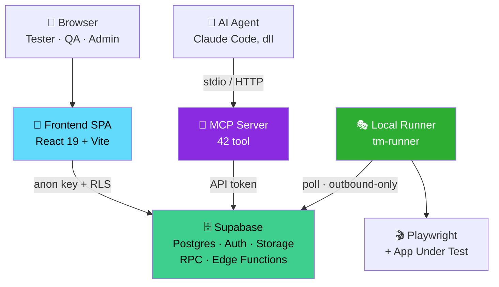
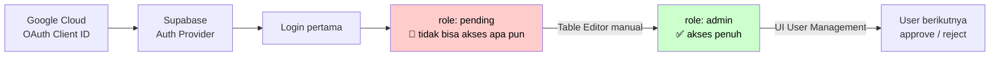
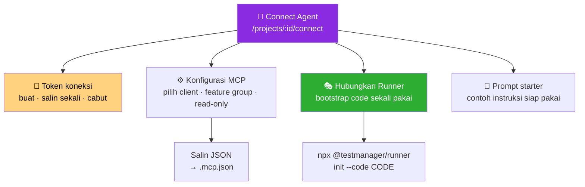
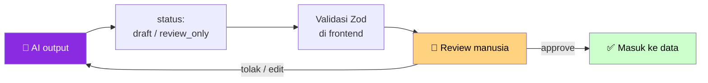
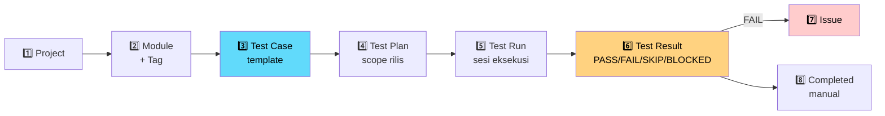
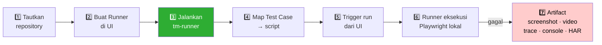
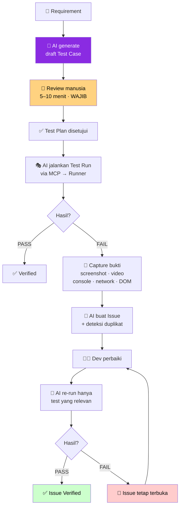

<div align="center">

# 🧪 TestManager

**Test management platform dengan automation Playwright lokal dan MCP server untuk AI agent.**

Kelola Test Plan, Test Case, dan Test Run — lalu biarkan AI agent ikut menulis,
menjalankan, men-triage, dan memverifikasi pengujian tanpa pernah kehilangan
kendali manusia.

<br>


<br>

[Mulai](#-quick-start) ·
[Arsitektur](#-arsitektur) ·
[MCP Server](#-mcp-server--42-tool-untuk-ai-agent) ·
[Agent Skills](#-agent-skills) ·
[Connect Agent](#-connect-agent--menyambungkan-ai--runner) ·
[Fitur AI](#-fitur-ai) ·
[Workflow Lengkap](#-workflow-lengkap-end-to-end)

</div>

---

## 📑 Daftar Isi

<table>
<tr><td valign="top" width="33%">

**Dasar**
- [Kenapa aplikasi ini ada](#-kenapa-aplikasi-ini-ada)
- [Fitur utama](#-fitur-utama)
- [Arsitektur](#-arsitektur)
- [Struktur repository](#-struktur-repository)
- [Quick Start](#-quick-start)

</td><td valign="top" width="33%">

**Setup**
- [1 — Database Supabase](#1--database-supabase)
- [2 — Google OAuth & admin](#2--google-oauth--admin-pertama)
- [3 — Frontend](#3--frontend)
- [4 — Local Runner](#4--local-runner)
- [5 — MCP Server](#5--mcp-server)
- [6 — Edge Functions](#6--edge-functions-fitur-ai)

</td><td valign="top" width="33%">

**Lanjutan**
- [MCP Server & 42 tool](#-mcp-server--42-tool-untuk-ai-agent)
- [Agent Skills](#-agent-skills)
- [Connect Agent](#-connect-agent--menyambungkan-ai--runner)
- [Fitur AI](#-fitur-ai)
- [Koneksi lain](#-koneksi-lain)
- [Workflow lengkap](#-workflow-lengkap-end-to-end)
- [Model domain](#-model-domain)
- [Arsitektur frontend](#-aturan-arsitektur-frontend)
- [Perintah](#-perintah-yang-tersedia)
- [Testing](#-testing) · [Deploy](#-deploy)
- [Troubleshooting](#-troubleshooting)
- [Author](#-author--kontributor)

</td></tr>
</table>

---

## 💡 Kenapa aplikasi ini ada

> Kebanyakan tool test management memperlakukan hasil eksekusi sebagai properti
> dari test case. Begitu test dijalankan ulang, hasil lama tertimpa — dan
> riwayat pengujian rilis sebelumnya hilang selamanya.

TestManager memisahkan tiga hal yang sering dicampur:

| | Peran | Menyimpan hasil? |
|:--|:--|:--|
| 📋 **Test Case** | Template pengujian | ❌ **Tidak pernah** |
| ▶️ **Test Run** | Satu sesi eksekusi; re-run = run **baru** | ❌ Hanya metadata |
| ✅ **Test Result** | Satu baris per (run × case) | ✔️ **Di sinilah hasil hidup** |

Konsekuensinya: riwayat bisa ditelusuri lintas rilis, dan progress/summary selalu
**dihitung ulang on-the-fly** dari `test_results` — tidak pernah disimpan sebagai
kolom yang bisa basi.

---

## ✨ Fitur utama

<table>
<tr>
<td width="50%" valign="top">

### 🗂️ Test Management
- Project, Module, Tag, Test Suite
- Test Case dengan structured steps
- Test Plan + approval manusia
- Test Run, Result, Issue tracking
- Requirement traceability & coverage
- Environment & assignment management

</td>
<td width="50%" valign="top">

### 🤖 Automation
- Local Runner Playwright (outbound-only)
- Codegen → mapping otomatis ke Test Case
- Artifact: screenshot, video, trace, HAR
- Browser/device matrix, headed & slow-mo
- Live job log, pause-on-failure
- Regression selektif (re-run yang relevan)

</td>
</tr>
<tr>
<td width="50%" valign="top">

### 🧠 AI & Agent
- MCP server, **42 tool**
- **4 Agent Skill** siap pasang
- Generate Test Case dari requirement
- Analisis Test Run & deteksi flaky
- Draft Issue + deteksi duplikat
- Semua output berstatus `draft` / `review_only`

</td>
<td width="50%" valign="top">

### 🔐 Platform
- Google OAuth + RBAC berbasis RLS
- API token & webhook dengan delivery log
- CI/CD ingest (GitHub Actions, GitLab, Jenkins)
- Team & granular permission
- Observability, audit trail, notification center
- Backup, retention, data management

</td>
</tr>
</table>

---

## 🏗️ Arsitektur



| Zona | Komponen | Berjalan di |
|:--|:--|:--|
| 👤 **Pengguna** | Browser · AI Agent | Mesin masing-masing |
| ☁️ **Server Pusat** | Frontend SPA · Supabase | Hosting / self-hosted |
| 💻 **Lokal / On-Prem** | MCP Server · Local Runner · Playwright | Mesin yang bisa mengakses app under test |

<details>
<summary><b>Tiga keputusan desain yang menentukan bentuk ini</b> (klik untuk buka)</summary>

<br>

**1. Server pusat tidak pernah menjalankan browser.**
Aplikasi yang diuji sering berada di `localhost`, jaringan internal, atau di
balik VPN — tempat yang tidak bisa dijangkau server. Runner dipasang di mesin
yang **bisa** menjangkaunya.

**2. Runner hanya konek keluar.**
Ia mem-*poll* job dan tidak pernah membuka port. Aman di balik NAT dan firewall
tanpa konfigurasi jaringan apa pun.

**3. Keamanan ada di database, bukan di UI.**
Route guard React (`ProtectedRoute`, `AdminRoute`) murni untuk UX. Yang
benar-benar menahan akses adalah RLS policy di Postgres — jadi sesi yang bocor
pun tetap terbatas pada haknya, dan MCP/API token tidak bisa melampaui scope
project-nya.

</details>

---

## 📁 Struktur repository

```
shiftech-test-mgr/
├── 🎨 frontend/            React 19 + Vite (SPA) — inti produk
│   └── src/
│       ├── config/         Supabase client (satu-satunya tempat init)
│       ├── repositories/   Query mentah + mapping row → domain
│       ├── services/       Business logic & validasi
│       ├── hooks/          Jembatan lifecycle React ↔ service
│       ├── components/     UI reusable
│       └── pages/          Route-level orchestration
├── 🗄️  supabase/            ~95 file schema SQL + 3 Edge Function
├── 🎭 runner/              CLI `tm-runner` — eksekutor Playwright lokal
├── 🔌 mcp/                 MCP server — 42 tool untuk AI agent
├── 🧩 skills/              4 Agent Skill siap pasang
├── 📦 packages/agent-core/ Kode bersama runner + MCP
├── 🚀 deploy/              Script deploy VPS
├── 🛠️  scripts/             Rilis runner & pemeriksaan dependency
└── 📚 docs/                PRD, arsitektur, integrasi, smoke test
```

---

## ⚡ Quick Start

```bash
git clone https://github.com/NvlFR/shiftech-test-mgr.git
cd shiftech-test-mgr/frontend
npm install
cp .env.example .env      # isi VITE_SUPABASE_URL & VITE_SUPABASE_ANON_KEY
npm run dev               # → http://localhost:5173
```

> [!IMPORTANT]
> Aplikasi **tidak akan berfungsi** sebelum schema Supabase dijalankan dan admin
> pertama ditetapkan manual. Lihat [Setup 1](#1--database-supabase) dan
> [Setup 2](#2--google-oauth--admin-pertama) — dua langkah ini wajib.

**Prasyarat:** Node.js 20+ · npm · akun Supabase · Google Cloud project (OAuth) ·
Playwright project (hanya jika memakai runner).

---

# 🔧 Setup

## 1 — Database Supabase

Tidak ada migration runner otomatis. Schema dijalankan **manual dan berurutan**
lewat Supabase SQL Editor — tiap file bergantung pada tabel/fungsi file
sebelumnya.

<details open>
<summary><b>Urutan eksekusi</b></summary>

<br>

**Tahap A — fondasi berurutan:**

```
1. supabase/schema.sql                      # domain tables awal
2. supabase/schema_auth.sql                 # profiles, trigger, RLS awal
3. supabase/schema_project_lifecycle.sql    # projects.status, soft-delete
4. supabase/schema_test_management_v2.sql   # modules, tags, test_runs, results, issues
5. supabase/schema_entity_codes.sql         # kolom code auto (TC-0001, TR-0001, …)
```

**Tahap B — fondasi tanpa nomor** (urutan bebas di antara mereka):

```
schema_project_members.sql   schema_project_roles.sql   schema_p2_workflow.sql
schema_issue_attachments.sql schema_issue_code.sql      schema_test_run_notes.sql
```

**Tahap C — seluruh file bernomor, urut naik:**

```
schema_011_environment_management.sql  →  schema_090_rui06_runner_diagnostics.sql
```

Nomor **adalah** urutan eksekusi. Jangan melompat.

**Opsional — data contoh:**

```
supabase/seed.sql
```

</details>

> [!WARNING]
> Ada dua pasang nomor kembar (`029` dan `060`) sisa pengembangan paralel.
> Keduanya independen — **jalankan dua-duanya**; urutan di dalam pasangan tidak
> berpengaruh. Jangan mengira salah satunya harus dilewati.

---

## 2 — Google OAuth & admin pertama

Login **hanya** lewat Google OAuth. Tidak ada email/password sama sekali.



**Langkah:**

1. **Google Cloud Console** → *APIs & Services* → *Credentials* → buat
   **OAuth 2.0 Client ID** bertipe *Web application*.
2. Tambahkan **Authorized redirect URI**:
   ```
   https://<project-ref>.supabase.co/auth/v1/callback
   ```
3. **Supabase Dashboard** → *Authentication* → *Providers* → **Google** →
   aktifkan, isi Client ID + Client Secret.
4. *Authentication* → *URL Configuration* → set **Site URL** ke alamat frontend
   (mis. `http://localhost:5173`).

### Menetapkan admin pertama

Signup pertama mendapat role `pending` dan **tidak bisa mengakses apa pun** —
ini disengaja, bukan bug. Tidak ada mekanisme otomatis untuk admin pertama
(keputusan produk, lihat [`docs/PRD.md`](docs/PRD.md)):

```
1. Login sekali lewat Google        → baris `profiles` terbentuk
2. Supabase Table Editor → profiles → ubah `role`: pending → admin
3. Refresh aplikasi                 → akses penuh
```

Setelah itu, approval user berikutnya dilakukan dari UI (**User Management**).

**Alur role:** `pending` → *(approve)* → `user` → *(promote)* → `admin`,
atau `pending` → *(reject)* → `rejected`.
User `pending` diblokir di **dua lapis**: route guard React **dan** RLS Supabase.

---

## 3 — Frontend

```bash
cd frontend
npm install
cp .env.example .env
npm run dev            # http://localhost:5173
```

| Variable | Wajib | Keterangan |
|:--|:-:|:--|
| `VITE_SUPABASE_URL` | ✅ | URL project Supabase, mis. `https://abc.supabase.co` |
| `VITE_SUPABASE_ANON_KEY` | ✅ | Anon/publishable key. Aman di browser — RLS yang menjaga data. |
| `VITE_PLAYWRIGHT_TRACE_VIEWER_URL` | — | Default `https://trace.playwright.dev/` |

> [!CAUTION]
> **Jangan pernah** menaruh `service_role` key di variable `VITE_*`. Semua
> variable berawalan `VITE_` **ikut ter-bundle ke JavaScript yang dikirim ke
> browser** dan bisa dibaca siapa pun yang membuka DevTools.

---

## 4 — Local Runner

Diperlukan hanya jika ingin menjalankan automation Playwright dari TestManager.

### Cara cepat — bootstrap code (disarankan)

Dari halaman **Connect Agent** di project, buat bootstrap code lalu:

```bash
npx @testmanager/runner init --code <BOOTSTRAP_CODE>
```

Runner menukar kode sekali-pakai itu dengan runner token, lalu menulis `.env`
berpermission `0600` secara otomatis. Kode kedaluwarsa dalam **±10 menit**.

### Cara manual

```bash
cd runner
cp .env.example .env
chmod 600 .env         # wajib di Linux/macOS — runner menolak file yang terbaca user lain
npm install
npm run build
```

Buat runner di UI (**Automation → Runner Baru**), salin token yang **hanya tampil
sekali**, lalu isi `.env`:

| Variable | Wajib | Keterangan |
|:--|:-:|:--|
| `TM_SUPABASE_URL` | ✅ | Sama dengan `VITE_SUPABASE_URL` |
| `TM_SUPABASE_ANON_KEY` | ✅ | Sama dengan `VITE_SUPABASE_ANON_KEY` |
| `TM_RUNNER_TOKEN` | ✅ | Token sekali-tampil dari UI |
| `TM_PROJECT_DIR` | — | Fallback path absolut ke Playwright project |
| `TM_REPOSITORY_CACHE_DIR` | — | Cache clone repository remote |
| `TM_PLAYWRIGHT_CMD` | — | Default `npx playwright test` |
| `TM_PLAYWRIGHT_HEADED` | — | Default `false` |
| `TM_POLL_INTERVAL_SECONDS` | — | Default `5` |
| `TM_JOB_TIMEOUT_SECONDS` | — | Default `900` |

### 🛡️ Trust repository — langkah wajib

> [!WARNING]
> Playwright memuat konfigurasi Node **sebelum** file test — artinya
> `playwright.config.ts` bisa menjalankan kode apa pun di mesin Anda. Karena itu
> runner bersifat **fail-closed**: setiap root Git harus dipercaya eksplisit satu
> kali, **setelah** Anda memeriksa isinya.

```bash
node dist/index.js trust /absolute/path/to/playwright-project
npm start
```

Daftar trust tersimpan lokal di
`~/.config/testmanager/trusted-repositories.json` dengan permission `0600`
(bisa dipindah lewat `TM_TRUST_STORE_PATH`).

### Subcommand runner

| Perintah | Fungsi | Butuh kredensial? |
|:--|:--|:-:|
| `npm start` | Mode normal — poll job dari server | ✅ |
| `npm start -- --headed` | Browser terlihat untuk semua job | ✅ |
| `npm start -- --slow-mo=250` | Delay 250 ms per operasi | ✅ |
| `npm start -- codegen <url>` | Rekam script → petakan ke Test Case | ✅ |
| `npm start -- sync` | Deteksi script baru → tawarkan mapping | ✅ |
| `npm start -- ui <spec>` | Playwright UI Mode | ❌ |
| `npm start -- debug <spec>` | Playwright Inspector (`PWDEBUG=1`) | ❌ |
| `npm start -- watch tests` | Re-run saat file berubah | ❌ |
| `npm start -- init e2e` | Buat Playwright project minimal | ❌ |
| `npm start -- init --code <CODE>` | Setup pakai bootstrap code | ❌ |
| `npm start -- trust <path>` | Percayai satu root repository | ❌ |

📖 Detail lengkap: [`runner/README.md`](runner/README.md)

---

## 5 — MCP Server

```bash
cd mcp
cp .env.example .env
npm install
npm run build
node --env-file=.env dist/index.js
```

| Variable | Wajib | Keterangan |
|:--|:-:|:--|
| `TM_SUPABASE_URL` | ✅ | URL Supabase |
| `TM_SUPABASE_ANON_KEY` | ✅ | Anon key; RLS tetap berlaku |
| `TM_API_TOKEN` | ✅ | API token TestManager (dari Integrasi Project) |
| `TM_PROJECT_ID` | ✅ | Project yang mengikat satu sesi MCP |
| `TM_MCP_READONLY` | — | `1` = tool tulis **tidak diregistrasikan sama sekali** |
| `TM_MCP_TRANSPORT` | — | `stdio` (default) atau `http` |
| `TM_MCP_HTTP_HOST` | — | Default aman `127.0.0.1` |
| `TM_MCP_HTTP_PORT` | — | Default `3000` |
| `TM_MCP_RATE_LIMIT` | — | Default `120` panggilan per window |
| `TM_MCP_RATE_LIMIT_WINDOW_SECONDS` | — | Default `60` |
| `TM_MCP_RERUN_FAILED_MAX_TESTS` | — | Ambang aman regression, default `25` |

> [!TIP]
> `TM_MCP_READONLY=1` bukan sekadar penolakan saat dipanggil — tool tulis **tidak
> muncul di discovery MCP**, jadi agent tidak tahu tool itu ada. Ini cara paling
> aman memberi agent akses baca ke data produksi.

> [!CAUTION]
> Mode stdio berkomunikasi lewat stdin/stdout. **Jangan** menulis log biasa ke
> stdout — itu akan merusak frame protokol MCP dan client gagal parse.

---

## 6 — Edge Functions (fitur AI)

| Function | Fungsi |
|:--|:--|
| `ai-gateway` | Proxy ke provider AI. Menjaga API key provider **tidak pernah** sampai ke browser. |
| `automation-artifacts` | Signed URL untuk screenshot, video, trace, log. |
| `repo-credentials` | Penyimpanan kredensial repository lewat Supabase Vault. |

```bash
supabase functions deploy ai-gateway
supabase functions deploy automation-artifacts
supabase functions deploy repo-credentials
```

<details>
<summary><b>Secret untuk <code>ai-gateway</code></b></summary>

<br>

Diset di environment Edge Function — **bukan** di `frontend/.env`:

```text
AI_PROVIDER=mock                    # default aman untuk dev & test
AI_MODEL=<model-provider>
OPENAI_API_KEY=<jika-openai>
GEMINI_API_KEY=<jika-gemini>
AI_TIMEOUT_MS=10000
AI_MAX_RETRIES=1
AI_RATE_LIMIT_MAX=20
AI_RATE_LIMIT_WINDOW_SECONDS=60
AI_ALLOWED_ORIGINS=http://localhost:5173
```

`SUPABASE_URL`, `SUPABASE_ANON_KEY`, dan `SUPABASE_SERVICE_ROLE_KEY` disuntikkan
otomatis oleh platform.

</details>

📖 Detail: [`docs/AI_INTEGRATION.md`](docs/AI_INTEGRATION.md)

---

# 🔌 MCP Server — 42 tool untuk AI agent

MCP (Model Context Protocol) membuka data TestManager ke AI agent secara
terkontrol. Satu sesi MCP **terikat ke satu project** — token yang bocor tidak
bisa melompat ke project lain.

## Memasang di client

<details open>
<summary><b>Claude Code</b></summary>

<br>

Tambahkan ke `.mcp.json` di root project Anda:

```json
{
  "mcpServers": {
    "testmanager": {
      "command": "node",
      "args": ["/absolute/path/to/mcp/dist/index.js"],
      "env": {
        "TM_SUPABASE_URL": "https://your-project.supabase.co",
        "TM_SUPABASE_ANON_KEY": "your-anon-key",
        "TM_API_TOKEN": "your-api-token",
        "TM_PROJECT_ID": "your-project-uuid",
        "TM_MCP_READONLY": "1"
      }
    }
  }
}
```

</details>

<details>
<summary><b>Mode HTTP (remote / self-hosted)</b></summary>

<br>

```bash
TM_MCP_TRANSPORT=http TM_MCP_HTTP_PORT=3000 node --env-file=.env dist/index.js
```

Default listen di `127.0.0.1`. Gunakan `0.0.0.0` **hanya** di balik reverse proxy
atau firewall — server ini memegang API token project Anda.

</details>

> [!TIP]
> Halaman **Connect Agent** di setiap project menghasilkan konfigurasi ini
> otomatis: pilih client, pilih feature group, aktifkan read-only, lalu salin.
> Tidak perlu menyusun JSON manual.

## Daftar tool

<details open>
<summary><b>📖 Read — 15 tool</b> <i>(selalu aktif)</i></summary>

<br>

| Tool | Fungsi |
|:--|:--|
| `testmanager.project.list` | Daftar project yang bisa diakses token |
| `testmanager.project.get` | Detail project sesi ini |
| `testmanager.testcase.search` | Cari test case: module, tag, priority, status, teks bebas |
| `testmanager.testcase.get` | Detail lengkap + structured steps + version history |
| `testmanager.testplan.list` | Daftar test plan |
| `testmanager.testplan.get` | Test plan + seluruh test case dalam scope, terurut |
| `testmanager.testrun.list` | Daftar test run + summary yang dihitung on-demand |
| `testmanager.testrun.get` | Satu test run + summary |
| `testmanager.testresult.list` | Hasil per test run |
| `testmanager.issue.search` | Cari issue |
| `testmanager.issue.get` | Detail issue |
| `testmanager.requirement.list` | Daftar requirement |
| `testmanager.requirement.get` | Detail requirement |
| `testmanager.requirement.coverage` | Coverage requirement ↔ test case |
| `testmanager.artifact.get_url` | Signed URL artifact (screenshot, video, trace) |

</details>

<details>
<summary><b>✍️ Write — 14 tool</b> <i>(hilang total saat <code>TM_MCP_READONLY=1</code>)</i></summary>

<br>

| Tool | Fungsi |
|:--|:--|
| `testmanager.testcase.create_bulk` | Buat banyak test case sekaligus |
| `testmanager.testcase.update` | Perbarui test case |
| `testmanager.testcase.duplicate` | Duplikat test case |
| `testmanager.testcase.archive` | Arsipkan test case |
| `testmanager.testplan.create` | Buat test plan |
| `testmanager.testplan.add_cases` | Tambah test case ke plan |
| `testmanager.testplan.remove_cases` | Keluarkan test case dari plan |
| `testmanager.testrun.create` | Buat test run baru |
| `testmanager.testrun.record_result` | Catat PASS/FAIL/SKIP/BLOCKED |
| `testmanager.testrun.complete` | Tandai run selesai *(butuh aksi manusia)* |
| `testmanager.issue.create` | Buat issue dari result FAIL |
| `testmanager.issue.comment` | Komentari issue |
| `testmanager.issue.update_status` | Ubah status issue |
| `testmanager.issue.detect_duplicate` | Deteksi duplikat via AI gateway |

</details>

<details>
<summary><b>🎭 Automation — 6 tool</b></summary>

<br>

| Tool | Fungsi |
|:--|:--|
| `testmanager.automation.runner_list` | Daftar runner + status online |
| `testmanager.automation.job_status` | Status job automation |
| `testmanager.automation.map_script` | Petakan test case ↔ script Playwright |
| `testmanager.automation.enqueue` | Antrekan job ke runner |
| `testmanager.automation.rerun_failed` | Re-run hanya test yang gagal |
| `testmanager.automation.verify_regression` | Verifikasi issue resolved lewat regression |

</details>

<details>
<summary><b>📊 Analysis — 3 tool</b></summary>

<br>

| Tool | Fungsi |
|:--|:--|
| `testmanager.analysis.run_summary` | Ringkasan + pola kegagalan satu run |
| `testmanager.analysis.flaky_candidates` | Kandidat test flaky dari riwayat |
| `testmanager.analysis.suggest_retest` | Saran scope retest |

</details>

<details>
<summary><b>📂 Repository — 4 tool</b></summary>

<br>

| Tool | Fungsi |
|:--|:--|
| `testmanager.repo.list_files` | Daftar file repository tertaut |
| `testmanager.repo.read_file` | Baca isi file |
| `testmanager.repo.search` | Cari di dalam repository |
| `testmanager.repo.diff` | Diff antar commit/branch |

</details>

📖 Kontrak lengkap: [`docs/MCP_SERVER.md`](docs/MCP_SERVER.md) · [`mcp/README.md`](mcp/README.md)

---

# 🧩 Agent Skills

Empat skill yang mengajari AI agent **cara kerja TestManager yang benar** —
termasuk invariant domain yang tidak boleh dilanggar. Tanpa ini, agent cenderung
menyimpan hasil di Test Case atau menandai run selesai sendiri.

| Skill | Kapan dipakai |
|:--|:--|
| 🔄 **`testmanager-workflow`** | Mengubah data, menjalankan/mengulang pengujian, mengelola hasil & issue, memasang runner |
| ✍️ **`testmanager-authoring`** | Menulis, mereview, mengimpor, atau mengaudit kualitas Test Case |
| 🔍 **`testmanager-triage`** | Triage FAIL/BLOCKED, membaca artifact, menyusun issue actionable |
| 🎯 **`testmanager-regression`** | Memilih scope regression relevan untuk issue resolved atau perubahan kode |

## Memasang skill

<details open>
<summary><b>Claude Code</b></summary>

<br>

Salin folder skill yang dipilih ke `.claude/skills/` di root project Anda:

```bash
cp -r skills/testmanager-workflow    ~/project-anda/.claude/skills/
cp -r skills/testmanager-authoring   ~/project-anda/.claude/skills/
cp -r skills/testmanager-triage      ~/project-anda/.claude/skills/
cp -r skills/testmanager-regression  ~/project-anda/.claude/skills/
```

Skill aktif otomatis saat agent mengerjakan tugas yang cocok dengan
`description`-nya.

</details>

<details>
<summary><b>Skills CLI</b></summary>

<br>

```bash
npx skills add https://github.com/NvlFR/shiftech-test-mgr \
  --skill testmanager-workflow \
  --skill testmanager-authoring \
  --skill testmanager-triage \
  --skill testmanager-regression
```

</details>

<details>
<summary><b>Agent lain (OpenAI-compatible)</b></summary>

<br>

Setiap skill menyertakan `agents/openai.yaml` untuk platform agent lain. Lihat
[`skills/manifest.json`](skills/manifest.json) untuk daftar dan metode instalasi.

</details>

## Contoh yang dijaga skill

> **`testmanager-workflow`** memaksa agent: *"Ubah Test Run menjadi `completed`
> hanya melalui aksi eksplisit user; jangan menyimpulkannya dari seluruh hasil
> yang sudah terisi."*
>
> **`testmanager-authoring`** memaksa agent: *"Hindari kata samar seperti
> 'berhasil', 'normal', atau 'sesuai' tanpa indikator."*
>
> **`testmanager-triage`** memaksa urutan baca bukti: *error/stack dan console →
> screenshot/DOM → trace/video → network HAR → metadata repository*, dengan
> korelasi timestamp antar-artifact.

---

# 🔗 Connect Agent — menyambungkan AI & Runner

Halaman **Connect Agent** (`/projects/:id/connect`) adalah satu pintu untuk
menyambungkan apa pun ke sebuah project.



## Alur menyambungkan AI agent

```
1. Buka project → Connect Agent
2. Buat token koneksi     → beri nama, salin sekali (tidak bisa dilihat lagi)
3. Pilih client MCP       → Claude Code, dll
4. Pilih feature groups   → read / write / automation / analysis / repo
5. Aktifkan read-only     → disarankan untuk percobaan pertama
6. Salin konfigurasi      → tempel ke .mcp.json
7. Restart client         → 42 tool (atau subsetnya) tersedia
8. Pakai prompt starter   → contoh instruksi yang sudah terbukti aman
```

## Alur menyambungkan Runner

```
1. Connect Agent → Hubungkan Runner
2. Salin perintah yang dihasilkan:
     npx @testmanager/runner init --code <BOOTSTRAP_CODE>
3. Jalankan di mesin yang bisa mengakses aplikasi under test
4. Runner menukar kode → runner token → tulis .env permission 0600
5. Periksa repo + playwright.config.*, lalu:
     tm-runner trust /absolute/path/to/repo
6. tm-runner                 → heartbeat mulai terkirim
7. Cek status "Runner terhubung" di UI
```

> [!IMPORTANT]
> Bootstrap code adalah **rahasia sementara** walau sekali pakai dan kedaluwarsa
> ±10 menit. Jangan menulisnya ke source, dokumentasi, log, atau riwayat kerja
> agent. Runner token yang dihasilkan **tidak boleh dibaca atau dilaporkan** oleh
> agent.

---

# 🧠 Fitur AI

Semua fitur AI berjalan lewat Edge Function `ai-gateway`. **Browser tidak pernah
memanggil OpenAI/Gemini langsung** dan tidak pernah menerima API key provider.

| Action | Input | Output |
|:--|:--|:--|
| `generate_test_cases` | Requirement teks, Excel, CSV, dokumen | Draft test case, skenario, edge case |
| `test_run_analysis` | Satu Test Run | Ringkasan status, pola failure, area risiko, rekomendasi retest |
| `issue_draft` | Test Result FAIL | Draft issue siap review |
| `duplicate_issue_detection` | Issue baru | Kandidat duplikat + confidence + alasan |
| `assistant_search` | Pertanyaan bebas | Pencarian terstruktur dalam project aktif |

## Pagar pengaman



Yang **tidak bisa** dilakukan AI, di level database — bukan sekadar UI:

- ❌ Mengubah status Test Result atau Test Run
- ❌ Menghapus atau menggabungkan Issue
- ❌ Melewati review manusia sebelum Test Plan disetujui
- ❌ Menandai Test Run `completed` tanpa aksi eksplisit user

**Provider:** OpenAI · Gemini · `mock` (default aman untuk development dan test).
Ganti lewat secret `AI_PROVIDER` di Edge Function.

## Analisis & Dashboard

- **Run summary** — PASS/FAIL/SKIP/BLOCKED/NOT RUN, pola kegagalan, area risiko
- **Flaky candidates** — test yang hasilnya tidak stabil lintas run
- **Suggest retest** — scope retest yang paling bernilai
- **Dashboard Report** (`/dashboard`) — tren lintas project, ekspor PDF/Excel
- **Requirement coverage** — requirement mana yang belum tercakup test case

---

# 🌐 Koneksi lain

## 🔑 API Token

**Integrasi Project** → *API Token*. Token project-scoped dengan prefix terlihat,
scope terbatas, dan bisa dicabut kapan saja. Dipakai oleh MCP server dan
integrasi pihak ketiga. Nilai penuh **hanya tampil sekali** saat dibuat.

## 📡 Webhook

**Integrasi Project** → *Webhook*. Kirim event TestManager ke sistem lain, dengan
**delivery log** yang mencatat status, jumlah percobaan, kode HTTP, dan error.
Secret bisa di-*rotate* tanpa membuat ulang webhook.

## 🔄 CI/CD

**Integrasi CI/CD** (`/projects/:id/integrations/cicd`). Pipeline mengirim hasil
test langsung menjadi Test Run.

| Provider | Nilai `provider` |
|:--|:--|
| GitHub Actions | `github_actions` |
| GitLab CI | `gitlab_ci` |
| Jenkins | `jenkins` |
| Local Runner internal | `runner_internal` |
| Lainnya | `generic` |

Setiap pipeline punya token sendiri yang **hanya tampil sekali**.
📖 [`docs/CI_CD_INTEGRATION.md`](docs/CI_CD_INTEGRATION.md)

## 📂 Repository

Tautkan source code ke project agar runner tahu di mana script berada dan issue
bisa menunjuk commit/file spesifik.

| Mode | Keterangan |
|:--|:--|
| `local_path` | Path lokal di mesin runner |
| `github_public` | Repo publik — tanpa kredensial |
| `github_private` | Repo privat — token disimpan di **Supabase Vault**, bukan di tabel biasa |
| `git_url` | URL Git generik |

Kredensial repository **tidak pernah** diteruskan ke proses Playwright, dan nilai
environment bernama sensitif dimask sebagai `[REDACTED]` di logger, live log,
artifact log, serta fatal error.

---

# 🔁 Workflow lengkap (end-to-end)

## A. Workflow QA manual



Progress dan summary **tidak perlu** di-update manual — selalu dihitung ulang
dari `test_results` setiap kali dibaca.

## B. Workflow automation



Mapping script bisa manual, atau otomatis lewat `tm-runner codegen`
(rekam sambil jalan) dan `tm-runner sync` (deteksi script baru di repo).

## C. Workflow AI end-to-end 🌟

Inilah alasan MCP dan Skills ada — siklus QA penuh dengan manusia sebagai
gerbang persetujuan, bukan sebagai operator setiap langkah.



### Apa yang membuat loop ini aman

| Gerbang | Ditegakkan di | Kenapa penting |
|:--|:--|:--|
| Review Test Case AI | Database | AI tidak bisa memasukkan test case tanpa manusia melihatnya |
| Approval Test Plan | Database | Scope pengujian selalu keputusan manusia |
| `completed` manual | Database | Sistem tidak tahu apakah tester sudah benar-benar selesai |
| Ambang regression | MCP (`TM_MCP_RERUN_FAILED_MAX_TESTS`) | Di atas ambang, agent wajib minta konfirmasi |
| Trust repository | Runner (fail-closed) | Kode asing tidak bisa jalan diam-diam di mesin tester |
| Read-only mode | MCP registry | Tool tulis tidak muncul sama sekali di discovery |

---

## 🧬 Model domain

```
Project
  ├─ Module         (master per project; satu Test Case = satu Module)
  ├─ Tag            (label bebas, many-to-many ke Test Case)
  ├─ Test Case      (TEMPLATE — tidak pernah menyimpan hasil)
  ├─ Test Suite     (pustaka test case yang bisa dipakai ulang)
  └─ Test Plan      (cakupan: test case mana untuk rilis/siklus ini)
       └─ Test Run  (satu sesi eksekusi)
            └─ Test Result   (PASS/FAIL/SKIP/BLOCKED, tester, executed_at)
                 └─ Issue    (0..N per result yang FAIL)
```

### ⛔ Invariant yang tidak boleh dilanggar

| Aturan | Alasan |
|:--|:--|
| `test_cases` & `test_plan_cases` tidak punya kolom hasil | Hasil selalu milik `test_results` |
| Re-run = Test Run **baru** | Riwayat rilis sebelumnya tidak boleh hilang |
| Summary dihitung on-the-fly | Kolom tersimpan pasti basi |
| Status "Completed" selalu manual | Sistem tidak tahu apakah tester sudah selesai |
| Tester harus user terdaftar (`profiles`) | Teks bebas tidak bisa diaudit |
| Issue hanya dari Test Result FAIL | Menjaga rantai bukti tetap utuh |

📖 Tipe lengkap: [`frontend/src/types/domain.ts`](frontend/src/types/domain.ts)

---

## 📐 Aturan arsitektur frontend

```
Component/Page  →  Hook  →  Service  →  Repository  →  Supabase
```

> [!WARNING]
> **Jangan pernah melompati layer.** Page tidak boleh memanggil repository
> langsung; component tidak boleh memanggil Supabase langsung.

| Layer | Tanggung jawab | Larangan |
|:--|:--|:--|
| `config/` | Inisialisasi Supabase client (satu-satunya tempat) | — |
| `repositories/` | Query mentah + mapping row → domain | **Tidak boleh** ada business rule |
| `services/` | Business logic, validasi, orkestrasi lintas repo | Tidak menyentuh React |
| `helpers/` | Fungsi murni | Tidak boleh punya side effect |
| `hooks/` | Jembatan lifecycle React ↔ service | — |
| `components/` | UI reusable, terima props/callback | Tidak memanggil service |
| `pages/` | Orkestrasi hooks + components | Tidak memanggil repository |

<details>
<summary><b>Konvensi & urutan membuat modul baru</b></summary>

<br>

**Konvensi:**
- Semua **kode** dalam Bahasa Inggris; **label UI** boleh Bahasa Indonesia
- Supabase kolom `snake_case`, domain type `camelCase` — mapping **selalu** lewat
  `helpers/mappers.ts`
- Halaman **list** wajib memakai `<PageHeader title=… actions=… />`;
  halaman **detail** memakai `<h2 className="m-0">` di dalam `Card`
- UI: **PrimeReact v10** (bukan v11), tema `lara-light-blue`, layout **PrimeFlex**,
  ikon **PrimeIcons**

**Urutan membuat modul baru:**

```
1. Tabel di supabase/schema_*.sql
2. Domain type di types/domain.ts
3. Row mapper di helpers/mappers.ts
4. Repository di repositories/{module}Repository.ts
5. Service di services/{module}Service.ts
6. Hook di hooks/use{Module}.ts
7. Halaman di pages/{module}/
8. Route di App.tsx
9. Menu item di components/layout/AppLayout.tsx
```

</details>

---

## ⌨️ Perintah yang tersedia

<table>
<tr><td valign="top" width="34%">

**Frontend** `cd frontend`

| Command | Deskripsi |
|:--|:--|
| `npm run dev` | Vite dev server |
| `npm run build` | `tsc -b` + build prod |
| `npm run preview` | Preview build |
| `npm run lint` | oxlint |
| `npm test` | Vitest |
| `npm run test:coverage` | + coverage v8 |

</td><td valign="top" width="33%">

**Runner** `cd runner`

| Command | Deskripsi |
|:--|:--|
| `npm run build` | Compile TS |
| `npm run typecheck` | Tanpa emit |
| `npm test` | `node --test` |
| `npm start` | Jalankan runner |
| `npm run release:self-hosted` | Tarball + SHA256 |

</td><td valign="top" width="33%">

**MCP** `cd mcp`

| Command | Deskripsi |
|:--|:--|
| `npm run build` | Compile TS |
| `npm test` | `node --test` |
| `npm start` | Jalankan server |

</td></tr>
</table>

---

## 🧪 Testing

Tiga lapis, sengaja terpisah:

| Lapis | Tool | Cakupan |
|:--|:--|:--|
| Unit / komponen | Vitest + Testing Library | Service, helper, mapper, komponen |
| Integrasi runner & MCP | `node --test` | Kontrak transport, auth, eksekusi |
| Smoke manual | [`docs/MANUAL_SMOKE.md`](docs/MANUAL_SMOKE.md) | Alur yang butuh mata manusia |

```bash
cd frontend && npm test        # unit + komponen
cd runner   && npm test        # runner
cd mcp      && npm test        # MCP server
```

Utang teknis testing tercatat di [`docs/TEST_DEBT.md`](docs/TEST_DEBT.md).

---

## 🚀 Deploy

Frontend adalah SPA statis — **server tidak butuh Node.js sama sekali**. Build
terjadi di lokal/CI, server hanya menerima artifact.

```bash
bash deploy/deploy-vps.sh                  # npm ci + build + rsync
bash deploy/deploy-vps.sh --skip-install   # lewati npm ci
bash deploy/deploy-vps.sh --skip-build     # rsync dist/ yang sudah ada
```

Script ini idempotent: setiap deploy membuat direktori release baru lalu
memindahkan symlink `current` — rollback cukup dengan mengarahkan symlink balik.

> [!NOTE]
> Variable `VITE_*` **di-bake ke dalam bundle saat build**, bukan dibaca di
> server. Mengganti environment berarti harus build ulang.

### Rilis runner self-hosted

```bash
node scripts/release-runner.mjs
```

Menghasilkan tarball + `.sha256` + `release.json` di `frontend/public/runner/`.
Halaman publik `/runner/install` lalu menampilkan perintah instalasi beserta
checksum agar pengguna bisa memverifikasi unduhan sebelum menjalankannya.

---

## 🔧 Troubleshooting

<details open>
<summary><b>Masalah umum</b></summary>

<br>

| Gejala | Sebab & solusi |
|:--|:--|
| Login berhasil tapi semua halaman kosong | Role masih `pending`. Set ke `admin` lewat Table Editor. |
| Query mengembalikan array kosong padahal data ada | RLS memblokir. Periksa policy — jangan dilonggarkan sembarangan. |
| Fitur baru error walau build hijau | Ada file schema bernomor yang terlewat. Jalankan berurutan. |
| URL asing menampilkan halaman 404 aplikasi | Normal — itu `NotFoundPage`, bukan crash. |

</details>

<details>
<summary><b>Runner</b></summary>

<br>

| Gejala | Sebab & solusi |
|:--|:--|
| Runner menolak menjalankan script | Repository belum di-trust. Periksa isinya, lalu `tm-runner trust <path>`. |
| Runner menolak start karena `.env` | Permission terlalu longgar. `chmod 600 .env`. |
| Clone remote baru ditolak | Wajar — trust bersifat per-repository. Periksa hasil clone, lalu trust path cache yang ditampilkan pesan penolakan. |
| Status runner offline padahal proses jalan | Heartbeat gagal. Cek `TM_SUPABASE_URL` dan konektivitas keluar. |
| Bootstrap code ditolak | Sekali pakai dan kedaluwarsa ±10 menit. Buat baru dari Connect Agent. |

</details>

<details>
<summary><b>MCP & AI</b></summary>

<br>

| Gejala | Sebab & solusi |
|:--|:--|
| MCP client gagal parse response | Ada log yang ditulis ke stdout di mode stdio. Pindahkan ke stderr. |
| Tool tulis MCP tidak terlihat | `TM_MCP_READONLY=1` sedang aktif. |
| Tool ditolak dengan error scope | API token terikat project lain. Cek `TM_PROJECT_ID`. |
| Rate limit MCP tercapai | Naikkan `TM_MCP_RATE_LIMIT`, atau kurangi frekuensi panggilan agent. |
| `rerun_failed` minta konfirmasi | Scope melewati `TM_MCP_RERUN_FAILED_MAX_TESTS` (default 25). Disengaja. |
| Fitur AI mengembalikan data dummy | `AI_PROVIDER=mock` masih aktif. Set provider asli + API key di secret Edge Function. |

</details>

---

## 📚 Dokumentasi lanjutan

<table>
<tr><td valign="top" width="50%">

**Produk & arsitektur**
- [`docs/PRD.md`](docs/PRD.md) — scope, target pengguna, out-of-scope
- [`docs/ARCHITECTURE.md`](docs/ARCHITECTURE.md) — arsitektur teknis, skema DB
- [`docs/TASKS.md`](docs/TASKS.md) — work breakdown Epic → Feature → Task
- [`FEATURE_BACKLOG.md`](FEATURE_BACKLOG.md) — roadmap (sumber kebenaran)
- [`FEATURES.md`](FEATURES.md) — status fitur per modul
- [`TODO.md`](TODO.md) — sprint board aktif

</td><td valign="top" width="50%">

**Integrasi & operasional**
- [`docs/AI_INTEGRATION.md`](docs/AI_INTEGRATION.md) — provider AI, gateway
- [`docs/MCP_SERVER.md`](docs/MCP_SERVER.md) — kontrak tool MCP
- [`docs/CI_CD_INTEGRATION.md`](docs/CI_CD_INTEGRATION.md) — integrasi pipeline
- [`docs/MANUAL_SMOKE.md`](docs/MANUAL_SMOKE.md) — checklist smoke manual
- [`docs/TEST_DEBT.md`](docs/TEST_DEBT.md) — utang teknis testing
- [`CLAUDE.md`](CLAUDE.md) / [`AGENTS.md`](AGENTS.md) — panduan AI coding agent
- [`WORKLOG.md`](WORKLOG.md) — riwayat pekerjaan

</td></tr>
</table>

---

<div align="center">

## 👤 Author & Kontributor

**Noval Fauzi Rahman** — *Author & Maintainer*

[](https://github.com/NvlFR)
[](mailto:novalfr802@gmail.com)

<br>

**Kontributor**

Fahmi Fauzi Rahman — [`fahmifauzirahman@gmail.com`](mailto:fahmifauzirahman@gmail.com)

<br>

---

<sub>

**TestManager** · Dikembangkan sejak Juli 2026 · Dibangun dengan
React 19 · TypeScript · Vite · Supabase · PrimeReact · Playwright · MCP

[⬆️ Kembali ke atas](#-testmanager)

</sub>

</div>
